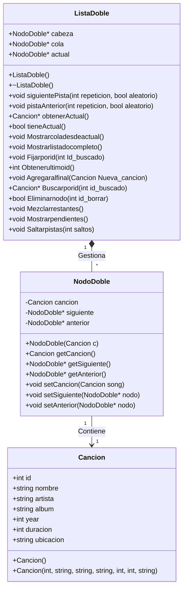

#  Reproductor de medios - Taller 1 Estructura de datos

## Integrantes
* Vicente Rojas Lillo

## Descripción del Proyecto
Este proyecto es un reproductor de medios basado en la consola de comandos, desarrollado en C++14. Permite a los usuarios gestionar y reproducir una biblioteca de música local a partir de archivos de texto (`music_source.txt`), manteniendo el estado de la reproducción entre sesiones (`status.cfg`). La arquitectura del software está construida íntegramente sobre estructuras de datos personalizadas (como Listas Doblemente Enlazadas), respetando la restricción de no utilizar los contenedores estándar (STL) de C++.

## Instrucciones de compilación y ejecución

El proyecto está diseñado para compilarse utilizando el estándar C++14. 

**Opción 1: mediante consola (g++)**
1. Abre una terminal y navega hasta el directorio raíz del proyecto.
2. Ejecuta el siguiente comando para compilar:
  g++ -std=c++14 main.cpp data_structures/*.cpp -o reproductor
3. y luego el siguiente para ejecutarlo:

* En Windows:* .\reproductor.exe

* En Linux/Mac:* ./reproductor

**Opción 2: Usando Visual Studio Code**

* Asegúrate de tener configurado el archivo settings.json o tasks.json para que el compilador utilice la bandera -std=c++14.

* Abre el archivo main.cpp y haz los mismos pasos de ejecucion que en la opcion 1.

## Funcionalidades Principales

* Navegación de Pistas: Reproducir, pausar, avanzar a la pista siguiente o retroceder a la anterior.

* Modos de Reproducción: Soporte para modo aleatorio y repetición (una pista o toda la lista).

* Gestión de Lista de Reproducción: Ver la lista actual, saltar a una canción específica, o agregar canciones al final de la cola.

* Mantenimiento del Registro: Leer datos desde un archivo base, agregar nuevas canciones al sistema y eliminar registros existentes.

